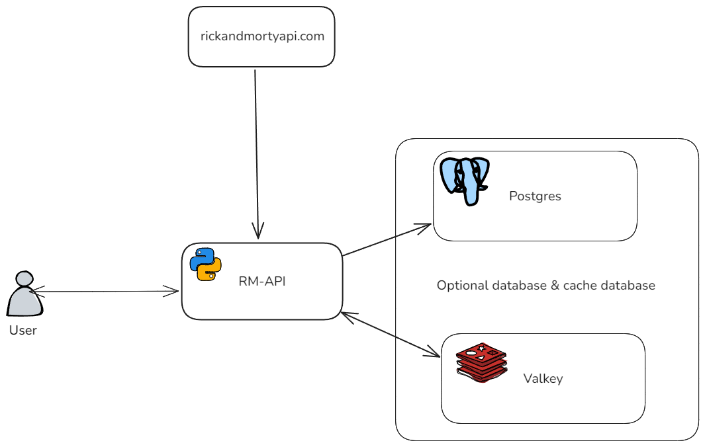
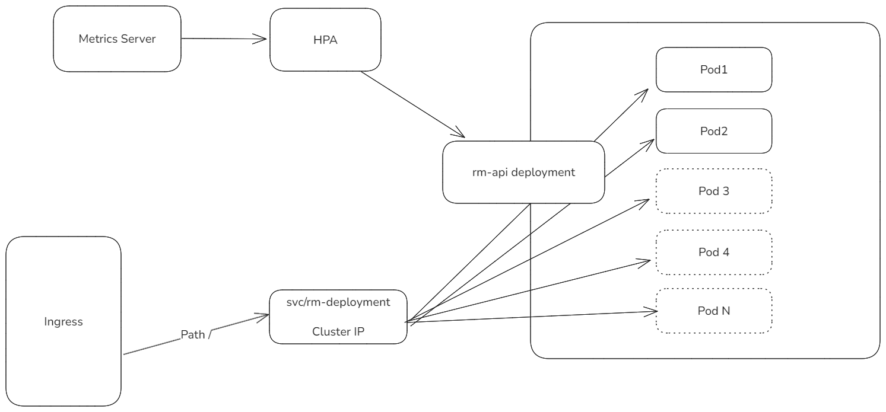

# rm-api

Repository for delivering the assignment `SRE Home Assignment V2`.

This repository contains the code for an FastAPI application that allows the user to get the characters from the [“Rick and Morty” API](https://rickandmortyapi.com/documentation/#rest) with the following characteristics:

- Species: “Human” 
- Status: “Alive” 
- Origin: “Earth (any variant, e.g., Earth (C-137), Earth (Replacement 
Dimension))”

API documentation can be found at `/docs` endpoint once the application is running. From there you can also get the OpenAPI specification at `/openapi.json`.

The application can run optionally with a valkey instance for caching the results and one postgresql instance for storing the results of the queries.



This repository also contains the definitions of the required resources to run the application inside a Kubernetes cluster as shown in the diagram:


## Local deployment

For deploying the solution in a local environment (no container) you need:
- uv (https://docs.astral.sh/uv/getting-started/installation/).

Once installed, install all the requirementes with `uv sync`. This will download the required python version and install all the dependencies (including dev dependencies).

You can run the app with the command: `uv run uvicorn main:app --host 0.0.0.0 --port 8000`.

For developing inside VS Code, you can add this to your `.vscode/launch.json` configurations:
```json
{
    "name": "Python Debugger: FastAPI",
    "type": "debugpy",
    "request": "launch",
    "module": "uvicorn",
    "args": [
        "main:app",
        "--reload"
    ],
    "jinja": true
}
```

For running the databases in local, `dev/docker-compose.yaml` file is provided. This spins up a postgres and a valkey services.

### Running the tests
Simply run `uv run pytest tests/unit`.

## Deploying to Kubernetes

A Helm chart is provided in `./helm` and can be deployed to a Kubernetes cluster with with:
```sh
helm install rmapi ./helm
```
Check the chart in order to see all the possible values that can be configured.

For example, for setting the hosts for the databases:

```sh
helm install rmapi ./helm --set redis.host=host.docker.internal --set postgres.host=host.docker.internal
```

## Known limitations / problems
- When running the tests, a DeprecationWarning is shown. I guess this has to be related on how the FastAPI TestClient handles the app context. This doesn't happen when running the app directly.
- The code only checks for the databases at startup. If the databases are not running / can't be reached when the app starts, it won't try to write/read from them.
